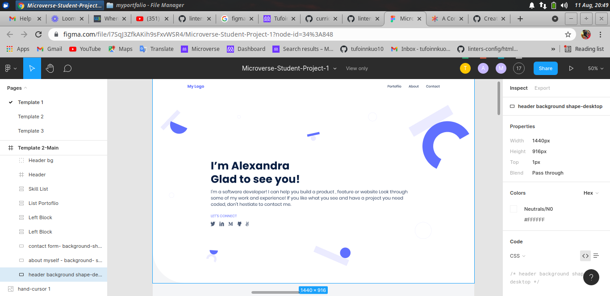

# Personal Portfolio

> A project aimed at creating a personal portfolio webpage, commiting and demanding a pull request and a code review. Other important tools were put into use as well such as linters.

css and html files were edited and put into use and also they were checked by linters to make sure they are up to the task.

add flex box and edit them.

add background image and edit.

add button and edit them.

## Built With

- Html
- Css
- VS code

## Live Link

[Live Demo Link](https://tufoinnkuo10.github.io/Hello-Microverse/)

## Getting Started

To get a local copy up and running follow these simple example steps.

### Prerequisites

- Internet connection
- github and git
- 15mb of storage

### Setup

RUN git clone https://github.com/tufoinnkuo10/Hello-Microverse

### Install

The user does not have to install anything

### Usage

Run the index.html

### Run tests 

No test required

## Authors

👤 **Author**

- GitHub: [@tufoinnkuo10](https://github.com/tufoinnkuo10)
- Twitter: [@itztenten](https://twitter.com/itztenten)
- LinkedIn: [LinkedIn](https://www.linkedin.com/in/tufoin-nkuo-3b272320b)

## 🤝 Contributing

Contributions, issues, and feature requests are welcome!

Feel free to check the [issues page](../../issues/).

## Show your support

Give a ⭐️ if you like this project!

## Acknowledgments

-All thanks aswell this project belongs to Microverse.

## 📝 License

This project is [MIT](./MIT.md) licensed.
