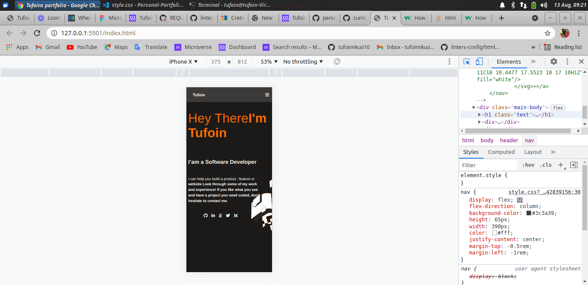

# Personal-Portfolio
A Demo web page of  my self

> My first project
Designed a personal webpage about myself with a template from Figma.
-Added other templates to the project

This milestone consist of two sections

1 The toolbar section
2 The headline section
3 Added buttons and the hover
4 Images and text about different portfolios
5 Icons for the different sections

## Built With

- Html
- Css
- VS code

## Live Link

[Live Demo Link](https://vigorous-turing-480551.netlify.app/)

##To get a local copy up and running follow these simple example steps
- Open your terminal
- Run git clone and paste the link above
- Open the folder on a code editor
- Create a branch and work on
- And finaly you can also demand for a pull request

### Prerequisites

- Internet connection
- github and git
- 100mb of storage

### Setup

RUN git clone https://github.com/tufoinnkuo10/Personal-Portfolio

### Install

The user does not have to install anything

### Usage

Run the index.html

### Run tests 

No test required

## Authors

👤 **Author**
- Name: Tufoin Nkuo
- GitHub: [@tufoinnkuo10](https://github.com/tufoinnkuo10)
- Twitter: [@itztenten](https://twitter.com/itztenten)
- LinkedIn: [LinkedIn](https://www.linkedin.com/in/tufoin-nkuo-3b272320b)

## 🤝 Contributing

Contributions, issues, and feature requests are welcome!

Feel free to check the [issues page](../../issues/).

## Show your support

Give a ⭐️ if you like this project!

## Acknowledgments

-All thanks aswell this project belongs to Microverse.

## 📝 License

This project is [MIT](./MIT.md) licensed.

